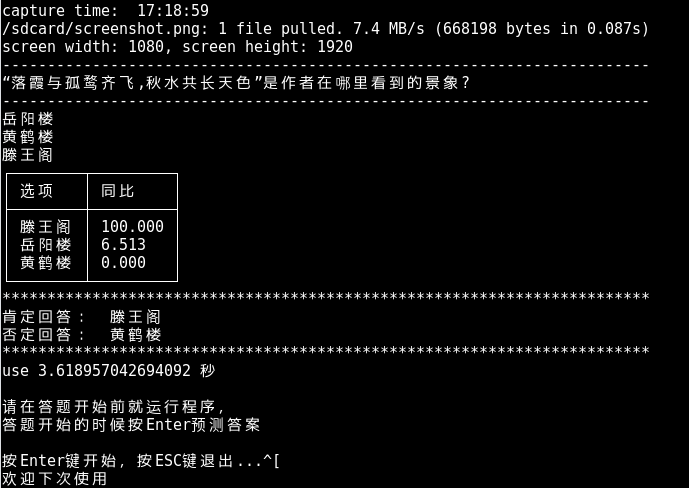

## 西瓜视频百万英雄助手

参考了微信跳一跳助手的思路，通过截取手机上面的题目识别问题和答案。
支持使用[汉王云 OCR ](https://market.aliyun.com/products/57124001/cmapi011523.html?spm=5176.730005.0.0.B1mZNd#sku=yuncode552300000)和[百度文字识别](https://cloud.baidu.com/product/ocr/general)。


本文的所有答案均来自百度知道的搜索，根据前两个投票最高的答案来，已经去除了广告，
答案均来自百度知道，优先选择最佳答案，如果没有最佳答案，选择前两个靠前的答案。

如果答案内容过长，使用文本摘要算法，显示最重要的5句。

移动端支持 Android / IOS 手机，程序运行时间是3秒左右（答题是10秒）。

## 运行




## 汉王OCR 百度OCR

**notice**: 第一次使用汉王阿里云只需要0.01元／100条，所以如果没有了，可以自己注册阿里云账号购买（[汉王](https://market.aliyun.com/products/57124001/cmapi011523.html?spm=5176.10695662.1996646101.searchclickresult.2d006e393rEVI7#sku=yuncode552300000)）。百度的注册开发者后创建应用就可以看见自己的 key 和 secret 。

## 分支说明

- master: 主要是 Android 手机使用，支持汉王和百度识别
- knearby: 根据文本关联度思想，答案更加清晰，目前只支持百度识别
- iso: 主要是苹果手机使用，支持百度和汉王

## V2 文本关联相似度分析

对于答题这样的项目，首先一个问题，然后有三个答案可以选择，能不能通过分别统计问题与三个答案的关联度来选择出正确的答案，由于数据采集是来自百度的，可能会受到部分广告数据的影响，但是在集合相当大的情况下，关联度还是会呈现正相关。

假设题目是：

*中国历史上著名的科举制度开始于那个朝代？*
- 汉朝
- 唐朝
- 隋朝

我们先用百度分别搜索`汉朝`，`唐朝`，`隋朝`，得到如下数据：

朝代 | 搜索出的数量（来自百度为您找到相关结果约）
---- | ------------------------------------------
汉朝 | 17900000
唐朝 | 30500000
隋朝 | 16600000

然后我们在用`题目` + 答案的方式，搜索示例：

`中国历史上著名的科举制度开始于那个朝代？ 汉朝` 得到三次的搜索结果：

 关键字  | 搜索出的数量（来自百度为您找到相关结果约）
-------- | ------------------------------------------
Q + 汉朝 | 602000
Q + 唐朝 | 837000
Q + 隋朝 | 658000

关联度计算方式：

``` shell
K = count(Q&A) / (count(Q) * count(A))
```

关联度如下：

答案 | 关联度
---- | ------
汉朝 | 0.0336
唐朝 | 0.0274
隋朝 | 0.0396


## Release

- 2017/1/9： 修复答案获取bug，增加长文本信息摘要算法，增加百度OCR
- 2017/1/9： 使用相似度猜测答案，请切换分支使用
- 2017/1/10： 增加ios分支，修复master文本摘要bug

## 部署

1. 从python官网安装python3.6环境
2. pip install -r requirements.txt
3. 创建默认的临时文件夹mkdir -p screenshots
4. 修改默认的配置文件`config.py`,配置文件夹中可以配置临时数据目录和appcode


## ADB工具配置

以 linux 为例：

1. 下载 android-platform-tools，访问[google](https://developer.android.google.cn/studio/releases/platform-tools.html)下载，默认 mac，windows， linux 均支持
2. 配置环境变量，进入 platform 目录下面`export PATH=$(pwd):PATH`配置 adb 工具到系统的 path 下面
3. 手机打开开发者模式
4. 使用usb连接手机后信任，`adb devices`来检查是否有自己的设备，确认已经连接
5. 接下来就进入百万英雄，等待有题目的时候就运行`python main.py`即可


## 贡献者（不分先后）

- [uniqhj](https://github.com/UniqHu)
- wangfpp

## 参考项目

- [wuditken/MillionHeroes](https://github.com/wuditken/MillionHeroes)
- [lingfengsan/MillionHero](https://github.com/lingfengsan/MillionHero)


## 交流学习

想要交流学习请添加我的 wechat ,
群已经满了100人了，需要邀请进群。

请加wexin后邀请：


qq: 294101042

