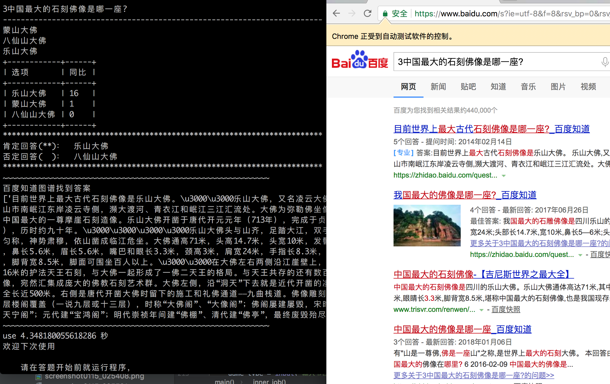
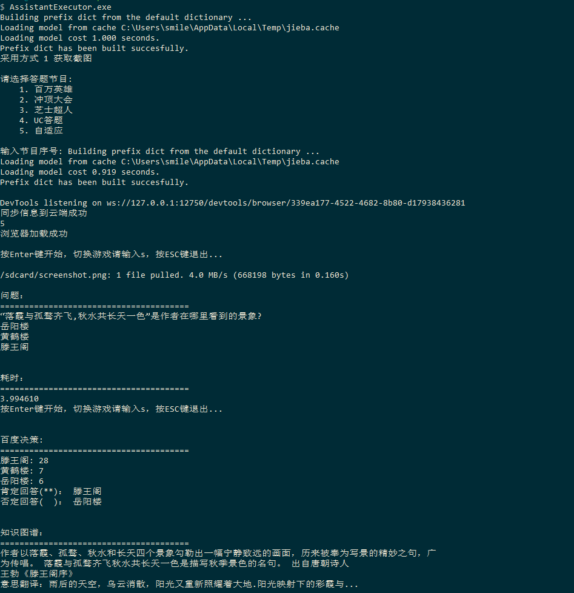
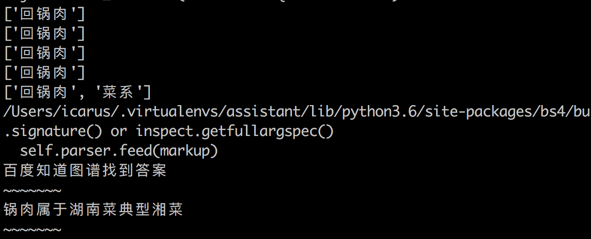
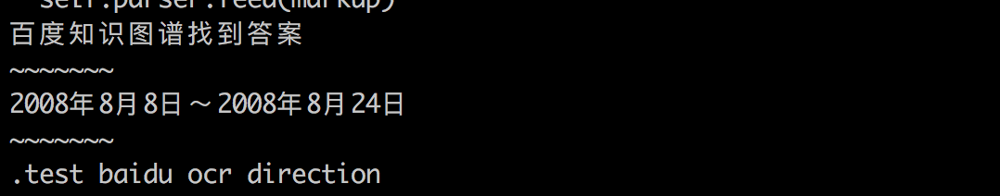
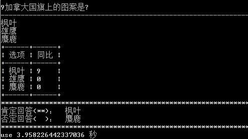
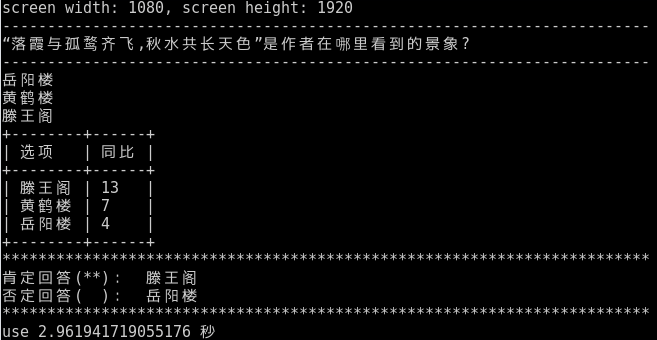
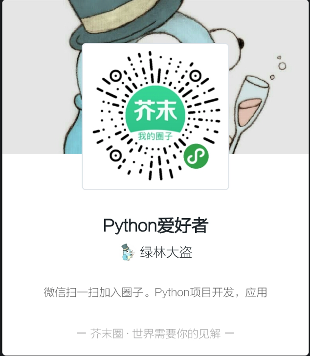

## 万能答题助手

参考了微信跳一跳助手的思路，通过截取手机上面的题目，利用[百度文字识别](https://cloud.baidu.com/product/ocr/general)识别问题和答案。

## 运行 
### 开启浏览器同步支持：


### 支持任意游戏模式：



### 科普性知识测试

#### 回锅肉属于什么菜系

#### 北京奥运会是什么时候



### 简洁版本：




# 我什么都不会勒，但是想带女友打怪升级

真有一个办法，提供了小白版本：

- 无需下载配置复杂的工具链
- 专人协助
- 一键运行

小白版本是基于目前的主干分支开发的，继承了主干分支的功能，主要是使用上面的配置的东西变少了，专门提供给不太懂技术的小白，大神请使用开源代码折腾。

~~**小白版本** 目前是需要收取一定的费用，价格是19.9（万能版本），如果只玩主流的四个，价格是9.9，请走捐赠入口捐赠后联系，或者加微信也可以，微信在最下面。~~

**由于时间的问题，没时间维护这个小白了，所以小白版本停止发售。**


# 只有 iphone, 没有 android 手机怎么办？

简单靠谱的办法是使用模拟器。

1. 首先还是要下载adb工具，下文有介绍
2. 下载[夜神](https://www.yeshen.com/)模拟器并安装
3. 安装完成后，打开 cmd, 检查是否有模拟器设备 `adb devices`
4. 在模拟器中安装答题应用
5. 运行答题辅助脚本`python main.py`,如果有问题下文有解决办法，请参照安装步骤

## **支持捐赠**

- [微信入口](./wechatcode/wechatpay.png)
- [支付宝](./wechatcode/alipay.jpg)

捐赠后请给我留言，如下福利：

- 项目结束后，整体讲解
- 免安装版提供支持，已完成，无需任何下载
- 无条件辅助安装包

## 开课了，有想要学习的可以加入圈子，长期更新

微信小程序：



## 百度OCR

**notice**: 百度的注册开发者后，创建应用就可以看见自己的 key 和 secret 。


## 部署

1. 从python官网安装python3.6环境
2. pip install -r requirements.txt
3. 创建默认的临时文件夹mkdir -p screenshots
4. 修改默认的配置文件`config.yaml`,配置文件夹中可以配置临时数据目录和appcode


## ADB工具配置

以 linux 为例：

1. 下载 android-platform-tools，访问[google](https://developer.android.google.cn/studio/releases/platform-tools.html)下载，默认 mac，windows， linux 均支持
2. 配置环境变量，进入 platform 目录下面`export PATH=$(pwd):PATH`配置 adb 工具到系统的 path 下面
3. 手机打开开发者模式
4. 使用usb连接手机后信任，`adb devices`来检查是否有自己的设备，确认已经连接
5. 接下来就进入百万英雄，等待有题目的时候就运行`python main.py`即可


## Win 打包方法

1. 安装`pyinstaller`工具
``` shell
pip install pyinstaller
```

2. 打包
``` shell
pyinstaller main.spec
```

打包完成后，在dist文件夹下面会有打包后的release.

## Release

>- 2018/2/18: 开源pyinstaller的配置文件
>- 2018/1/23: 使用多线程，改善mac上面的卡顿问题
>- 2018/1/22: 增加数据同步设置
>- 2018/1/21: 增加问题备份，增加搜狗，增加图片放缩，加速，游戏切换，自适应
>- 2018/1/18: 增加uc辅助，另外修复统计bug
>- 2018/1/15: 增加芝士大会的支持，另外增加特别关键字
>- 2018/1/14: 新增知识库功能, 内置adb，小白版一键运行
>- 2018/1/13: 增加浏览器支持，修复部分bug
>- 2018/1/12: 更改搜索策略，自动决策，减少python依赖
>- 2018/1/11: 结巴分词预编译和多核分词优化
>- 2018/1/10： 增加ios分支，修复master文本摘要bug
>- 2018/1/9： 修复答案获取bug，增加长文本信息摘要算法，增加百度OCR
>- 2018/1/9： 使用相似度猜测答案，请切换分支使用


## 分支说明

- master: 主要是 Android 手机使用，支持汉王 / 百度识别 / ocrspace
- knearby: 根据文本关联度思想，答案更加清晰，目前只支持百度识别


## V2 文本关联相似度分析

对于答题这样的项目，首先一个问题，然后有三个答案可以选择，能不能通过分别统计问题与三个答案的关联度来选择出正确的答案，由于数据采集是来自百度的，可能会受到部分广告数据的影响，但是在集合相当大的情况下，关联度还是会呈现正相关。

假设题目是： 

*中国历史上著名的科举制度开始于那个朝代？*
- 汉朝
- 唐朝
- 隋朝

我们先用百度分别搜索`汉朝`，`唐朝`，`隋朝`，得到如下数据：

朝代 | 搜索出的数量（来自百度为您找到相关结果约）
---- | ------------------------------------------
汉朝 | 17900000
唐朝 | 30500000
隋朝 | 16600000

然后我们在用`题目` + 答案的方式，搜索示例：

`中国历史上著名的科举制度开始于那个朝代？ 汉朝` 得到三次的搜索结果：

 关键字  | 搜索出的数量（来自百度为您找到相关结果约）
-------- | ------------------------------------------
Q + 汉朝 | 602000
Q + 唐朝 | 837000
Q + 隋朝 | 658000

关联度计算方式：

``` shell
K = count(Q&A) / (count(Q) * count(A))
```

关联度如下：

答案 | 关联度
---- | ------
汉朝 | 0.0336
唐朝 | 0.0274
隋朝 | 0.0396


## 贡献者（不分先后）

- [uniqhj](https://github.com/UniqHu)
- wangfpp
- [using1174](https://github.com/Using1174)
- [kakalote2008	](https://github.com/kakalote2008)
- [lonelam](https://github.com/lonelam)
- [luyiming](https://github.com/luyiming)
- [Snownee](https://github.com/Snownee)

## 参考项目

- [wuditken/MillionHeroes](https://github.com/wuditken/MillionHeroes)
- [lingfengsan/MillionHero](https://github.com/lingfengsan/MillionHero)
